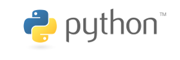

Profile
=======

My name is **Peter Bouda** and I am a **developer, project manager, educator and
consultant with over 15 years of experience** as employee and freelancer in IT.
See my list of `recent projects`_ below to read more about past projects and
please `contact me <{filename}contact.rst>`_ if you are looking for a developer,
educator or consultant in your company or project. My areas of expertise
include:

* **Platform-independent desktop and mobile applications** with
  **Qt/C++** and **PyQt**, for Windows (Phone), Mac OS, Linux, iOS, Android, Ubuntu
  Phone, Sailfish OS, Tizen, Raspberry Pi, embedded devices, ... (since 2003);
* **Web applications** with **Python® (Django, Flask, ...)**, **JavaScript**,
  **HTML** and **CSS** (since 1999);
* Integration and customization of **natural language processing (NLP)**
  technologies and applications like speech recognition, text-to-speech and
  machine translation (since 2004);
* **Test-driven development** with Python® and C++ (since 2008);
* **Agile methods** in project management, especially **Kanban** (since 2010).

I support `free software <https://fsfe.org>`_ and am the author of the book
`PyQt und PySide. GUI- und Anwendungsentwicklung mit Python® und Qt 
<http://www.amazon.de/gp/product/3941841505/ref=as_li_tf_tl?ie=UTF8&camp=1638&creative=6742&creativeASIN=3941841505&linkCode=as2&tag=jsusde-21>`_,
published by Open Source Press in Munich, Germany. I was a member of the
invitation-only, but discontinued Qt Ambassador Program of Nokia. In 2009
I was invited as project manager of the mobile app Shoot&Translate to the Top
Innovator competition of the Mobile World. I won the 1st prize of the Sapo
Codebits Coding Competition in 2010 (Jury's prize) and 2014 (Public's prize) as
project leader.

In 2010 I co-founded the `Centro Interdisciplinar de Documentação Linguística
e Social <http://www.cidles.eu/>`_, a non-profit organization located in Minde,
Portugal. Our goal is to document and preserve the linguistic heritage in
Europe. My main project at CIDLeS is `Poio <http://www.poio.eu/>`_, a curation
and software development project dedicated to open source technology for
language diversity. To read more about my work and research at CIDLeS please
visit my `profile page at the centre
<http://www.cidles.eu/about/team/peter-bouda/>`_.

I live in Munich, Germany and Alcanena, Portugal, contact details are
`on my contact page <{filename}contact.rst>`_.

Recent projects
---------------

Here is a list of my recent projects as freelancer and employee, in
chronological order:

Predictive text system Poio
...........................

* **Timeframe: 08/2013 -- now**
* **Roles: Project manager, developer and maintainer**
* **Technologies: Python, Flask, JavaScript, HTML, CSS, Postgres, nginx,
  mongrel, NLP, Kanban, test-driven (nose)**
* **Link:** http://www.poio.eu

Poio is a predictive text system for under-resourced languages. I developed
the open source project at the "Centro Interdisciplinar de Documentação
Linguística e Social" to support under-resourced languages. The data is extracted
from different online and private sources and processed via a Python-powered
pipeline to an internal annotation graph pivot format (ISO 24612, Language
resource management -- Linguistic annotation framework). N-gram models are
calculated from that data to support word predictions for user input. The online
demo is powered by a Flask web application. Within the project I work as a
developer and manager, supervising a changing development team that consists
of interns, freelancers and employees. This project was implemented test-driven
from the start (with the help of the Python library nose) and we applied Kanban
approach to organize the development in the team. I gave talks about this project
on events like the Sapo Codebits and the Summer School "Coding for Language
Communities".

Web-based interactive installation Freuden|Tanz
...............................................

* **Timeframe: 09/2014 -- 11/2014 (3 months)**
* **Roles: Developer**
* **Technologies: JavaScript, WebGL, three.js, Leap Motion**
* **Link:** https://vimeo.com/112967710

This piece of art was choreographed and designed by Stephan Jürgens, a
choreographer and dancer living in Lisbon. The installation was first presented
at the POST SCREEN festival 2014 at the Universidade Lisboa. I implemented the
WebGL interface based on Photoshop designs by Stephan. We used a Leap Motion
for hand tracking (the standard Leap Motion JavaScript API plus additional
smoothing of the tracking data for better user experience) and the three.js
library as a wrapper for WebGL. I developed a custom solution for platform and
browser independent input methods, so that the installation is also usable with
a mouse or a trackpad.

Web application QuantHistLing
.............................

* **Timeframe: 07/2010 -- 08/2014 (4 years, 2 months)**
* **Roles: Developer and administrator**
* **Technologies: Python, Pylons, JavaScript, HTML, CSS, Postgres, Apache, NLP**
* **Link:** http://quanthistling.info, http://lingpy.org

Within the project "Quantitative Historical Linguistcs" I worked as a software
developer on the Python web app and on Python libraries to process digitized
lexical data in a custom research workflow for retro-digitization of printed
dictionaries. I planned and implemented a solution to convert Microsoft Word
documents into annotated documents in a Postgres database. The goal was to allow
researchers to easily query, export and use the data in workflows for
quantitative language comparison. A Pylons web app to view and manually annotate
the data was part of the workflow.

Web application TypeCraft
.........................

* **Timeframe: 10/2013 -- 08/2014 (11 months)**
* **Roles: Consultant and developer**
* **Technologies: Java, JSP, Tomcraft, Python, HTML, JavaScript, CSS, Postgres, Kanban**
* **Link:** http://typecraft.org

In a cooperation between the "Norges teknisk-naturvitenskapelige universitet" in
Trondheim/Norway and the "Centro Interdisciplinar de Documentação
Linguística e Social" I planned, supervised and developed the integration of
file format conversion and automatic part-of-speech and semantic tagging into
the TypeCraft web application. The development involved a custom pipeline
from an existing open source tagger, a Python libary to convert file formats
and heteregenous linguistic data models and an existing Tomcat/JSP solution to
allow users to import and annotate language data on a web interface. We used
a Kanban method to organize the tasks that were implemented and tested in three
different locations. I was responsible for the planning and execution of the
tasks at CIDLeS and managed the communication between linguists and developers
within the cooperation.

Language data management libraries Poio API and GrAF-Python
...........................................................

* **Timeframe: 01/2012 -- 02/2014 (2 years, 2 months)**
* **Roles: Project manager, consultant and developer**
* **Technologies: Python, NLP, test-driven (nose), Kanban**
* **Link:** http://media.cidles.eu/poio/poio-api/

As a member of the working group "Linguistic Fieldwork, Anthropology, Language
Typology" of the european CLARIN programme for research infrastructure I was
part of the planning and implementation team of the two curation projects
"Poio API – a framework for processing fieldwork data in linguistic research"
and "Field Linguistic Tool Repository". The software development was done in
a cooperation between the "Centro Interdisciplinar de Documentação
Linguística e Social" and the "Cologne Center for eHumanities" at the University
of Cologne. I was a project manager and developer at CIDLeS, to implement the
Open Source Python libraries "graf-python" and "Poio API". "graf-python" is a 
Python implementation of GrAF (ISO 24612, the "Language resource management --
Linguistic annotation framework"), that we used as internal data model for the
conversion between different file formats and data models in linguistics. We
developed the libraries in a test-driven approach and applied Kanban for project
management.

Linguistic analysis tool Poio Analyzer
......................................
* **Timeframe: 01/2011 -- 08/2013 (two years, 9 months)**
* **Roles: Consultant and developer**
* **Technologies: Python, PyQt, NLP**
* **Link:** https://github.com/cidles/poio-analyzer

The development of Poio Analyzer was a cooperation between the "Centro
Interdisciplinar de Documentação Linguística e Social" and the University
of Regensburg. I planned and implemented a software to allow users to search
and analyze data from language documentation projects. The software supports
the analysis of data from different file formats in an easy-to-use interface.
The main goal was to allow linguists with no knowledge of programming or
statistics to query their language corpus and get meaningful results that they
may use in research publications like journal articles or descriptive grammars.

Annotation software Poio GRAID
..............................

* **Timeframe: 01/2011 -- 12/2011 (one year)**
* **Roles: Consultant and developer**
* **Technologies: Python, PyQt, NLP**

The development of Poio GRAID was a cooperation between the "Centro
Interdisciplinar de Documentação Linguística e Social" and the University
of Bamberg. The goal was to prototype a user interface that allowed linguists
to annotate data according to the GRAID ("Grammatical Relations and Animacy in
Discourse") system. I planned and implemented the solution and used PyQt for
the platform independent user interface.

App Linguadict for Nokia Meego and Symbian
..........................................

* **Timeframe: 09/2010 -- 02/2011 (6 months)**
* **Role: Developer**
* **Technologies: Qt, C++, Perl**

This project was a cooperation with `Linguatec language technologies
<http://www.linguatec.net>`_ to develop a mobile app from the data of their
Linguadict online dictionary. I developed a customized solution to process,
store and access the dictionary data on low-end mobile devices. I was also
responsible for the development of the UI on the Nokia Maemo, MeeGo and
Symbian S60 platforms.
